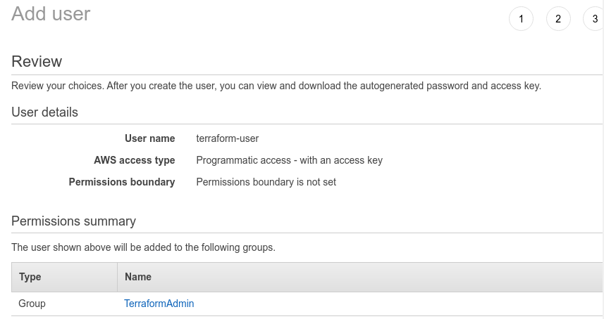
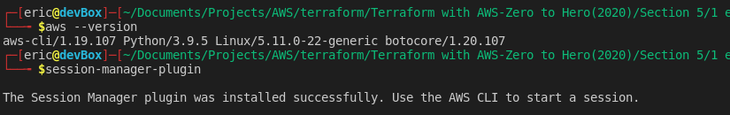
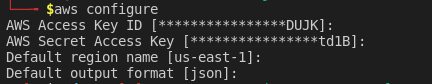

# Introduction to AWS

This section of the course dealt more with setting up the access that you need to be able to follow along with the course. Nothing much to write about, you will be creating an IAM user and generating Access and Secret Keys. This will be the user that you will setting for Terraform to use.

I deviated a little bit from the instructor in these particular areas:
*  I only gave my user programmatic access and removed console access.  

* I did not generate any keys. I plan on using AWS CLI SSM Session Manager to gain access to my EC2 instances.
* I created an IAM Role with the **AmazonSSMManagedInstanceCore** policy attached.

# How I Set My Access

On the AWS Console I created the following:
* IAM Group called **TerraformAdmin**. I gave this group **AdministratorAccess**, not exactly the best practice but this will do for the course.
* IAM User called **terraform-user**. This user is added to the **TerraformAdmin** group and only has programatic access.
* IAM Role called **terraform-ec2-role**. I attached the policy **AmazonSSMManagedInstanceCore** to this role and allowed it to be used by EC2 instances. This allows me to establish an SSM Session Manager session to my instances. The policy above grants a little more privileges so you want to only allow Session Manager connections and no other core SSM services, you can use [this](https://docs.aws.amazon.com/systems-manager/latest/userguide/getting-started-add-permissions-to-existing-profile.html) guide to create your own policy. 

On my laptop I installed the following:
* **awscli**. The fastest way to install this is through PIP. I ran the following command to get it on my system:  
```pip3 install awscli```  
This only installs awscli version 1. If you want to use version 2 you can use this command:  
```pip3 install awscliv2```  
* **SSM Session Manager Plugin**. This plugin will give you the **start-session** command for ssm in the aws cli.  Instructions on how to install the plugin can be found [here](https://docs.aws.amazon.com/systems-manager/latest/userguide/session-manager-working-with-install-plugin.html).

Installing awscli through PIP installs the binary under your $HOME/.local/bin directory. So you will have to add that your $PATH environment variable. Once set you can test if the application and plugin are installed correctly by running:  

```aws --version```  

And  

```session-manager-plugin```  

If installed correctly you should get something like:  


Next we want to configure an AWS Profile that Terraform will use:  

```aws configure```  

You will need to input the Secret Key and Access Key that was generated earlier for your user. I set the default region to *us-east-1* and my default output to *json*  
  

And that is it. We are ready to start the course.
