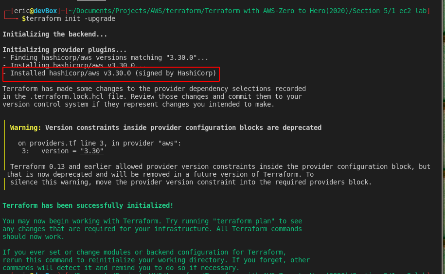

# AWS_INSTANCE

This section was more a brief introduction on how we create Terraform configuration files and usage of the Terraform command line.  

So a few things that we learn about:  
* We can create separate Terraform configuration files inside a folder.
* We see that once we invoke Terraform, it will run through the files in the directory that you run it in.  
* The files have an extension of **".tf"**.
* We learned about the **"provider"** and **"aws_instance"** resource blocks.  

So we learn that in the Terraform configuration file, we create blocks that define an aspect of our infrastructure. The first of which is the **provider** block. [**Providers**](https://www.terraform.io/docs/language/providers/index.html) are plugins that tells it which cloud provider, Saas provider, or API it will use. In this tutorial we are interested in the [**aws**](https://registry.terraform.io/providers/hashicorp/aws/latest/docs). Declaration of this in our configuration file is straight forward:  
```
provider "aws" {

}
```
  
The Terraform documentation on [aws](https://registry.terraform.io/providers/hashicorp/aws/latest/docs) provider shows us that there are several properties that we define in between the curly braces *{ }*. Of interest to me are the following properties:  
* **version** - here we can define what version of the aws provider plugin we want to use. If we leave this blank, terraform will use the latest version (at the time my writing [07/15/2021] it is version 3.48.0). This is important to me as newer versions of the plugin provide support for newer features and resources. For example, when we started usin Terraform in our environment the latest version was 2.15. We recently had to upgrade the EBS on our environment to use the newer [**gp3**](https://aws.amazon.com/ebs/general-purpose/) disks to use some of the features that it comes with. Now although version 2.15 does have support for **gp3** disks, it did not support 1 new feature of it. It did not support the **throughput** parameter. We had to upgrade our plugin to the latest version to get it to work.  
Now you may also be wondering why would you want to specify a version, when you can just let Terraform use the latest one by not specifying it in your configuration. That maybe true for test environments or in a non-professional environment, but if you plan on rolling out your template to a large group of people, you do not want to have version sprawl. As much as possible we want everyone to use the same version all through out our environment. Differences in minor version maybe ok, but sometimes the difference between major version can be significant (always test your template after upgrading to a different major version) and things that you set may not work on different versions of the plugin.  
You can specify versions in different ways. You specify a specific version by using:  
```
version = "<version number>"
```  


Or you can tell terraform to use a version greater than a value:  
```
version = "~><version number>"
```

  

  You may also notice that in the screenshots above Terraform gave us a warning that version constraints insider provider blocks are deprecated. This is because I declared the version number inside the **provider "aws" { }** block, when since version 0.13 you need to specify the version number in the **terraform { }** block like below:  
  ```
  terraform {
      required_providers {
          aws = {
              source = "hasicorp/aws"
              version = "<version number>"
          }
      }
  }
  ```  

  When switching provider versions, you will need to issue the command:  
  ```
  terraform init -upgrade
  ```  

It is also inside the **provider "aws" { }** block where you can specify the authentication type you want to use. The Terraform [documentation](https://registry.terraform.io/providers/hashicorp/aws/latest/docs) gives you several options on how you want Terraform to authenticate with AWS. In the course, you are asked to specify the Access Key and Secret Key that was generated in section 3 of the course. On my end I decided to use shared credentials as my authentication. As I mentioned in my notes for [section 3](../Section_3/section_3.md) I created a an AWS profile by running the *aws configure* command. This creates credentials file in my $HOME/.aws directory. If you do not specify any authentication method in your Terraform configuration file when you run *terraform init*, Terraform will check if you have specified anything in the AWS_PROFILE environment variable. If you did not set anything in the environment variable it will check if you have a credentials file in $HOME/.aws, which is what I have. It will use the profile called **"default"** by default. This is the profile that is generated when you run *aws configure*. If your credentials file is located elsewhere or you are using a different profile you can specify these in the **provider "aws" { }** block by setting the **shared_credentials_file** and **profile** properties.  Alternatively you can run:  
```
export AWS_PROFILE=<profile name>
```  
Before  running any *terraform* command to do the same thing.  

