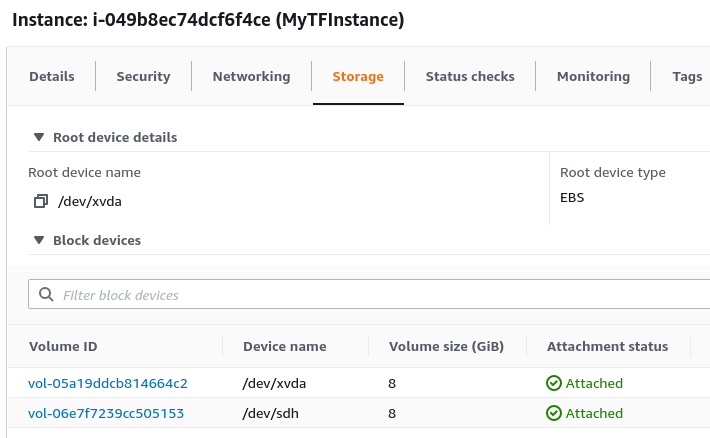
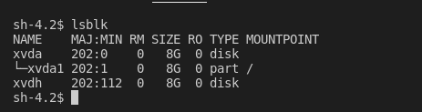

# More About Resources  

The important things in this section is that we see how we can use a property of an AWS resource that we created as a argument for another resource.  

To better understand this it will be good to read up on the Terraform configuration language [syntax](https://www.terraform.io/docs/language/syntax/configuration.html) and the syntax of the [resource](https://www.terraform.io/docs/language/resources/index.html) block first.  

So in a nutshell each Terraform configuration file will be composed of blocks. A block usually follows the following syntax:  
```
<type> "<label>" "<label>" {
    <argument01> = <value>
    ...
    <argumentXX> = <value>
}  
```  

Some block types only require 1 "label" (like the [variable](https://www.terraform.io/docs/language/values/index.html) block). In this section we will focus on the [resource](https://www.terraform.io/docs/language/resources/index.html) block.  

The resource block follows the syntax above. So we have:  
```  
resource "<AWS Resource Type>" "<Local Name>" {
    <argument01> = <value>

    <argument02> = {
        <argument> = <value>
    }  

    <argumentXX> = <value>
}  
```  

We declare a resource block by the word **"resource"** then we specify what type of AWS resource we need. You can get a list of Terraform supported AWS resources [here](https://registry.terraform.io/providers/hashicorp/aws/latest/docs). Next we give this resource a name. We can use this name to reference the resource later in the same configuration file on another configuration file in the same module. It is also worth noting that arguments can also have [expressions](https://www.terraform.io/docs/language/expressions/index.html) assigned to them instead of values.  

So with that out of the way, lets get to the meat of the section. Now lets use this example. We will create a Terraform configuration that:  
* Creates an EC2 instance
* Creates an EBS volume
* Attaches the EBS volume that we created to the EC2 instance that we created.  

First lets check out the [aws_instance](https://registry.terraform.io/providers/hashicorp/aws/latest/docs/resources/instance#ebs-ephemeral-and-root-block-devices) documentation. So we only need to specify an AMI (since we are not using a Launch Configuration). While I am at it, I might as well as specify an instance type so that I am sure that I use a *"t2.micro"*.  
```  
resource "aws_instance" "my_instance" {
    ami                 = "ami-0ab4d1e9cf9a1215a"
    instance_type       = "t2.micro"  

    tags                = {
        Name        = "MyTFInstance"
        Provisioner = "Terraform"
        }  

    availability_zone   = "us-east-1a"
}  
```  
Above we tell Terraform to create an AWS EC2 instance using the AMI and instance type that we specified. We also set some tags on the instance. This instance will be called **my_instance** in this module. I am also specifying the *availability zone* since I want to be able to attach the EBS volume that will be created below to this instance. 

Next lets create the [EBS volume](https://registry.terraform.io/providers/hashicorp/aws/latest/docs/resources/ebs_volume).  
```  
resource "aws_ebs_volume" "my_ebs_volume" {
    availability_zone   = "us-east-1a"
    size                = 8

    tags                = {
        Name            = "my_ebs_volume"
        Description     = "Attach to my instance"
    }
}  
```  

For the EBS volume we only need to specify what availability zone. I need this volume to be in the same AZ as my instance. I specified the size to keep my costs down.  

Finally we can create an attachment between the EC2 instance and the EBS volume using the **[aws_volume_attachment]**(https://registry.terraform.io/providers/hashicorp/aws/latest/docs/resources/volume_attachment).  
```
resource "aws_volume_attachment" "my_instance_my_volume" {
    device_name     = "/dev/sdh"
    volume_id       = aws_ebs_volume.my_ebs_volume.id
    instance_id     = aws_instance.my_instance.id
}  
```  

So I need to specify the EBS volume ID and EC2 instance ID of the reources that were created. This values will only be known after the creation of the resource. So in this situation we can reference the values from the attributes of the created resource.  

If you open the [aws_instance](https://registry.terraform.io/providers/hashicorp/aws/latest/docs/resources/instance#ebs-ephemeral-and-root-block-devices) and [aws_ebs_volume](https://registry.terraform.io/providers/hashicorp/aws/latest/docs/resources/ebs_volume), then scroll to the section **Attribute Reference** we can see what attributes the resources will return.  

Both **aws_instance** and **aws_ebs_volume** return the **id** attribute which is what we need. To reference this in our configuration file, we use the format:  
```  
<AWS Resource>.<Local Name>.<Attribute>
```  
You can check out my sample configuration [here](2_ec2_lab). This is what the created instance looks like in the AWS console:  
  

This is what it looks like inside the instance:  
