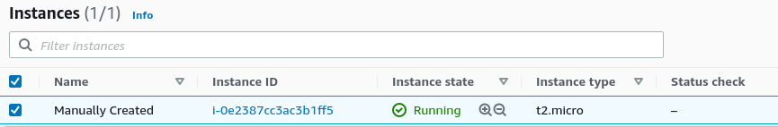

# Import  

The import command allows you to import a resource that was created outside of Terraform. This allows you migrate infrastructure that was created using other means into Terraform. Once imported, you can begin managing it through Terraform.  

Documentation for the command is [here](https://www.terraform.io/docs/cli/commands/import.html).  

There some very interesting quirks when you import a reousrce. As of this writing (08/03/2021) I am using Terraform version 1.0.1. These are the steps I took:  

1 Create an EC2 instance through the AWS Console. I named my instance "Manually Created".

2 I created an empty resource called "imported_instance".  
```
resource "aws_instance" "imported_instance" {
    ami                 = ""
    instance_type       = ""  
}   
```
3 I next run _terraform init_, then do a _terraform import_.  
```
terraform import aws_instance.imported_instance "<instance ID>"  
```
  

As we can see in the output above, the instance has been imported into Terraform and is now managed by it. If we do a _terraform refresh_ we can see that it refreshed the state of the instance:  

  

But if we look into our Terraform configuration file, we can see that the resource "imported_instance" is still empty:  


Currently the command _terraform import_ only import resources into the state. It does not generate configuration as written in [this](https://www.terraform.io/docs/cli/import/index.html) section of the Terraform CLI documentation.  

So as can be seen, our configuration file remains empty, but if you look into our terraform.tfstate file:  
  

We can see above that the instance we passed in our parameter did get imported into the state file.  

This does not mean that we cannot manage it. Lets change the tag name to "Managed Instance":  
```
resource "aws_instance" "imported_instance" {
    ami                 = "ami-0c2b8ca1dad447f8a"
    instance_type       = "t2.micro"

    tags                = {
        Name            = "Managed Instance"
    }  
}  
```

Not lets hit a _terraform apply -auto-approve_ to apply our changes:  


As seen above, we were able to make modifications to our imported instance. Now lets try a destructive change. Lets do a terraform destroy:


And we see that the instance was terminated:  


