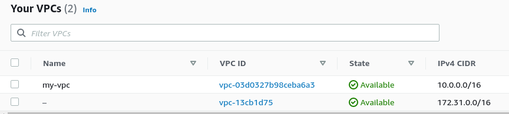
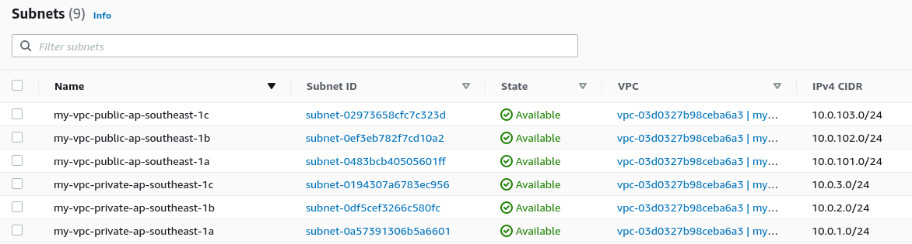
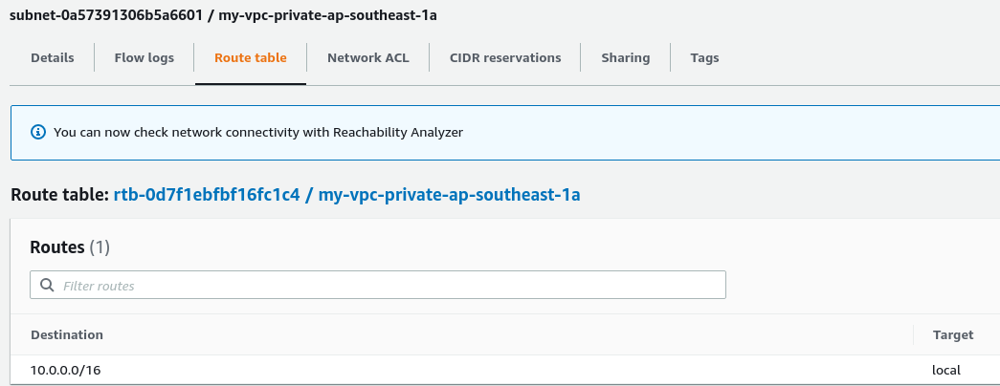

# Terraform Modules

Now modules is quite a big topic. It is important to note that the course only looks at local modules. Local modules are ones that you create locally. Terraform has an online module registry that can be used in place of local modules. You can find the AWS module registry [here](https://registry.terraform.io/providers/hashicorp/aws/latest).  

First lets go over how to use modules from the Terraform registry. Lets set up a new VPC using the [VPC module](https://registry.terraform.io/modules/terraform-aws-modules/vpc/aws/latest) in the registry.  

To use a module you need to declare it in your configuration:  
```
module "<name>" {
    source = "<path to module>"
    version = "<version number>"

    <property> = <value>
    ...
    <property> = <value>
}
```

Version number is optional. Technically you only need to declare the source and the required variables for the module to start using it. Source paths follow a certain naming convention for those in the registry, these are outlined under the section "Module best practice" located [here](https://learn.hashicorp.com/tutorials/terraform/module?in=terraform/modules).  

For our purpose we will set our source as **"terraform-aws-modules/vpc/aws"** as indicated in the documentation for the VPC module. Lets try out the sample below. I will be creating a new VPC in ap-southeast-1.  

```
module "vpc" {
  source = "terraform-aws-modules/vpc/aws"

  name = "my-vpc"
  cidr = "10.0.0.0/16"

  azs             = ["ap-southeast-1a", "ap-southeast-1b", "ap-southeast-1c"]
  private_subnets = ["10.0.1.0/24", "10.0.2.0/24", "10.0.3.0/24"]
  public_subnets  = ["10.0.101.0/24", "10.0.102.0/24", "10.0.103.0/24"]

  tags = {
    Terraform = "true"
    Environment = "dev"
  }
}
```
With the configuration above, I will be creating a VPC called **my_vpc** in **ap-southeast-1**. It will have the CIDR block **10.0.0.0/16**. It will include the **ap-southeast-1a, ap-southeast-1b and ap-southeast-1c** AZs.

We will also create 3 private subnets and 3 public subnets.

Let's check what was created. So here is the VPC:


Looks good. How about the subnets:


Now lets confirm that the public subnets have a route to the internet:


Finally lets confirm that the private subnets do not have a route to the internet:



## Local Modules  
Now the sample above show how we can use remote modules. Lets look at local modules. For this let us combine the configuration above with our new local module.  

We will use the remote module for our VPC and create a local module for our EC2 instances. Lets modify our VPC vpc.tf a bit and trim it to 1 AZ and 1 private subnet.  

```
module "vpc" {
  source = "terraform-aws-modules/vpc/aws"

  name = "my-vpc"
  cidr = "10.0.0.0/16"

  azs             = ["ap-southeast-1a"]
  private_subnets = ["10.0.1.0/24"]
  
  tags = {
    Terraform   = "true"
    Environment = "dev"
    Description = "Sample local module"
  }
}
```

Now in the folder where we have our vpc.tf file, let us create a folder called **modules**. We will create our EC2 configuration file inside that folder. We will also create a variables.tf file. We will want to expose some EC2 properties on our module so that it can be customized later.  

Here is our ec2.tf fle:
```
resource "aws_instance" "my_instance" {
    ami                 = var.ami_id
    instance_type       = var.ec2_instance_type  

    tags                = var.ec2_tags

    availability_zone   = var.ec2_az
    subnet_id           = var.ec2_subnet
}
```  

Now we will need to declare the variables that we used (a little bit backwards, as ideally we create the variables first, but bear with me).  
```
  variable "ami_id" {
    description = "The AMI ID to use"
    type        = string
    default     = "ami-087c17d1fe0178315" 
}

variable "ec2_instance_type" {
    description = "The EC2 instance type"
    type        = string
    default     = "t2.nano"      
}

variable "ec2_tags" {
    description = "Tags to use on the EC2 instance"
    type        = map(string)
    default     = {
        "Name"        = "Terraform Test"
        "Description" = "Test of local modules"
    }
}

variable "ec2_az" {
    description = "The AZ to place the EC2 instance in"
    type        = string
    default     = "ap-southeast-1a" 
}

variable "ec2_subnet" {
    description = "The subnet ID where we will create the EC2 instance"
    type        = string
}
```

While we are declaring the variables, lets also set some defaults. The only mandatory property we need will for the **subnet_id**. Our EC2 will have the following defaults:
* AMI ID set to a AWS Linux AMI.
* Instance Type set to t2.nano.
* Tags
* Availability Zone set to **ap-southeast-1a**.  

Now lets go back to our root directory where we have our vpc.tf file in and create another file called my_ec2.tf. 

